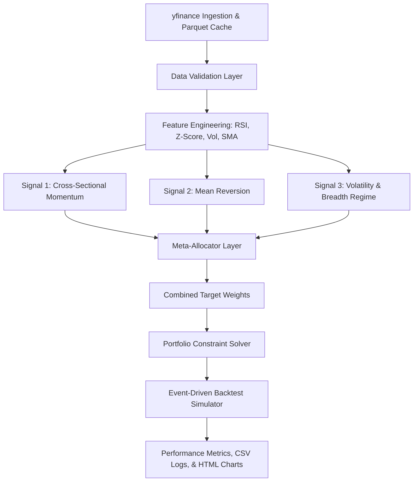

# 📈 Indian Equity Quant Research & Backtesting Engine

[](https://www.python.org/)
[](https://opensource.org/licenses/MIT)
[](https://github.com/psf/black)
[]()

A modular, reproducible, and mathematically rigorous Python-based quantitative research and portfolio simulation system built for the Indian equity market (NIFTY 100 universe). This platform facilitates signal research, portfolio optimization, realistic cost modeling, and performance evaluation.

---

## 📌 Table of Contents
1. [Core Features](#-core-features)
2. [System Architecture](#%EF%B8%8F-system-architecture)
3. [Strategy Definitions](#-strategy-definitions)
4. [Meta-Allocation Layer](#%EF%B8%8F-meta-allocation-layer)
5. [Transaction Cost Model](#-transaction-cost-model)
6. [Quick Start & Installation](#-quick-start--installation)
7. [Running the Engine](#-running-the-engine)
8. [Performance Outputs](#-performance-outputs)
9. [Data & Implementation Limitations](#-data--implementation-limitations)
10. [References](#-references)

---

## 🚀 Core Features

*   **Multi-Signal Suite**: Includes 3 distinct strategies (Momentum, Mean Reversion, and Volatility/Breadth Regime Filters).
*   **Dynamic Meta-Allocation**: Performance-chasing strategy weighting using rolling Sharpe ratios, correlation penalties, and drawdown gates.
*   **Realistic Backtesting Engine**:
    *   Executes on $t+1$ Open price using signals generated at $t$ Close (zero look-ahead bias).
    *   Incorporates SEBI-accurate fees, stamp duties, GST, STT, and slippage.
    *   Models cash buffers, position count restrictions, and weight caps.
*   **Comprehensive Risk Analytics**: Generates annual/monthly return heatmaps, drawdown profiles, rolling risk metrics, and interactive Plotly visuals.
*   **Walk-Forward Framework**: Supports strict out-of-sample (OOS) verification across multiple historical periods.

---

## ⚙️ System Architecture

```
quant-assignment/
├── config/              # YAML parameter configs (no hardcoded magic numbers)
│   ├── universe.yaml    # Asset universe (NIFTY 100) & split dates
│   ├── strategy.yaml    # Lookbacks, entry/exit indicators, thresholds
│   └── backtest.yaml    # Transaction fees, slippage, and weight caps
├── src/
│   ├── data/            # YFinance ingestion, parquet caching, and validation
│   ├── features/        # Returns, RSI, z-score, and market breadth logic
│   ├── signals/         # Base interface & concrete signal generators
│   ├── portfolio/       # Weight constraint solvers
│   ├── backtest/        # Event-driven daily simulation loops
│   ├── meta_allocator/  # Dynamic multi-strategy weighting
│   ├── risk/            # Sharpe, Max Drawdown, Calmar, Sortino computations
│   └── analytics/       # Plotly-based HTML chart rendering
├── tests/               # Unit testing coverage for signals, data, and backtester
├── scripts/             # Python command-line execution entry point
└── outputs/             # Generated HTML charts, blotters, and CSV sheets (gitignored)
```

### Process Flow Chart



---

## 📊 Strategy Definitions

### 1. Cross-Sectional 12-1 Month Momentum
*   **Lookback**: 252 trading days.
*   **Skip**: 21 trading days (removes short-term reversal contamination).
*   **Sizing**: Selects the top 20 stocks by cross-sectional momentum percentile and assigns equal weights.
*   **Rebalancing**: Monthly.
*   **Rationale**: Behavioral herding and investor underreaction to earnings news.
*   **Equation**:
    $$\text{Return}_{12-1} = \frac{P_{t-21}}{P_{t-252}} - 1$$

### 2. Short-Term Mean Reversion (RSI + Z-Score)
*   **Indicators**: 5-day Relative Strength Index (RSI) and 20-day return Z-Score.
*   **Entry**: RSI $< 30$ OR Z-Score $< -2.0$.
*   **Exit**: RSI $> 50$ AND Z-Score $> 0$.
*   **Allocation**: Max 15 positions, equally weighted.
*   **Rebalancing**: Weekly.
*   **Rationale**: Liquidity shocks and temporary market overreactions.

### 3. Volatility Regime & Market Breadth Filter
*   **Realized Vol**: 20-day annualized volatility compared to 126-day historical baseline.
*   **Breadth Filter**: Percentage of universe trading above their 200-day Simple Moving Average (SMA).
*   **Risk Mitigation**: Scales down portfolio exposure by **70%** if 20d volatility exceeds $1.5\times$ long-run volatility OR if less than **40%** of stocks are above their 200d SMA.

---

## ⚖️ Meta-Allocation Layer

The engine dynamically balances the Momentum and Mean Reversion strategies:
1.  **Rolling Sharpe Ratio**: Allocates relative weight based on the rolling 60-day Sharpe ratio.
2.  **Drawdown Gate**: Automatically cuts strategy weight by **50%** if the strategy suffers a peak-to-trough drawdown $>15\%$.
3.  **Correlation Penalty**: Scales down weights when strategy correlation rises above **80%**.
4.  **Regime Overlay**: Applies a risk-reduction multiplier when the volatility or breadth criteria are triggered.

---

## 💸 Transaction Cost Model

Based on SEBI and National Stock Exchange of India (NSE) guidelines:

| Charge Type | Rate Applied | Direction |
| :--- | :--- | :--- |
| **STT (Securities Transaction Tax)** | 0.10% | Sell Side |
| **Exchange Transaction Charges** | 0.00345% | Buy & Sell |
| **SEBI Regulatory Fee** | 0.0001% | Buy & Sell |
| **Stamp Duty** | 0.015% | Buy Side |
| **Brokerage** | 0.03% (capped at ₹20 per trade) | Buy & Sell |
| **GST** | 18.0% (on brokerage & exchange fee) | Buy & Sell |
| **Slippage** | 0.05% (5 bps fixed assumption) | Buy & Sell |

*A typical round-trip trade incurs approximately **29 to 30 basis points** in total execution drag.*

---

## 🛠️ Quick Start & Installation

### Prerequisites
*   **Python**: Version 3.11 or higher
*   **Git**: Required for cloning the repository

### Local Setup

1.  **Clone the Repository**:
    ```bash
    git clone https://github.com/your-username/quant-assignment.git
    cd quant-assignment
    ```

2.  **Create & Activate Virtual Environment**:
    *   **Windows (PowerShell)**:
        ```powershell
        python -m venv venv
        .\venv\Scripts\Activate.ps1
        ```
    *   **macOS / Linux**:
        ```bash
        python3 -m venv venv
        source venv/bin/activate
        ```

3.  **Install Dependencies**:
    ```bash
    pip install --upgrade pip
    pip install -r requirements.txt
    pip install -e .[dev]
    ```

---

## 💻 Running the Engine

### Full Backtest Execution
Run the end-to-end backtest pipeline using:
```bash
python scripts/run_backtest.py --config-dir config/
```

### Specific Period Run
Run over predefined partitions defined in `config/universe.yaml`:
```bash
# Training window (2015-2020)
python scripts/run_backtest.py --config-dir config/ --period train

# Out-of-Sample window (2023-2024)
python scripts/run_backtest.py --config-dir config/ --period oos
```

### Other Commands
*   **Force Data Refresh**: Skip the cache and fetch fresh pricing data from yfinance.
    ```bash
    python scripts/run_backtest.py --config-dir config/ --force-refresh
    ```
*   **Run Automated Unit Tests**:
    ```bash
    pytest tests/ -v
    ```
*   **Check Test Coverage**:
    ```bash
    pytest tests/ -v --cov=src --cov-report=html
    ```

---

## 📈 Performance Outputs

After a successful backtest run, all outputs are exported to the `outputs/` directory:

*   **Interactive Visualizations (HTML)**:
    *   `equity_curve.html`: Cumulative return path vs. NIFTY 50/100 benchmark.
    *   `drawdown_curve.html`: Time-series drawdown profiles.
    *   `monthly_heatmap.html`: Monthly performance grid across all years.
    *   `rolling_metrics.html`: Moving Sharpe, Sortino, and Volatility values.
    *   `meta_allocation.html`: Historical strategy allocation percentages.
    *   `regime_overlay.html`: Plot of regimes overlaying the equity path.
*   **CSV Logs**:
    *   `trade_blotter.csv`: Complete history of all executed buys/sells.
    *   `holdings_history.csv`: Daily weights held per asset.
    *   `equity_curve.csv`: Daily net asset values (NAV) and cash levels.

---

## ⚠️ Data & Implementation Limitations

1.  **Survivorship Bias**: Universe list is static as of December 2023. De-listed counters or bankrupt entities are omitted, which introduces an upward bias to historical backtest performance.
2.  **Point-in-Time Limitations**: Historical adjusted prices downloaded from Yahoo Finance incorporate retroactive dividend and stock split adjustments.
3.  **Market Impact**: Slippage is modeled as a fixed 5 bps rate. Under large asset allocations, larger trade sizes would trigger variable slippage and higher execution drag.
4.  **No Short Selling**: The model executes long-only portfolios. Performance during persistent bear markets might suffer compared to long-short or market-neutral setups.

---

## 📚 References

*   Jegadeesh, N. & Titman, S. (1993). *Returns to Buying Winners and Selling Losers*. Journal of Finance, 48(1).
*   De Bondt, W. F. M. & Thaler, R. (1985). *Does the Stock Market Overreact?* Journal of Finance, 40(3).
*   Asness, C., Moskowitz, T. & Pedersen, L. (2013). *Value and Momentum Everywhere*. Journal of Finance, 68(3).
*   Lo, A. (2002). *The Statistics of Sharpe Ratios*. Financial Analysts Journal, 58(4).
*   Ang, A. & Bekaert, G. (2002). *International Asset Allocation with Regime Shifts*. Review of Financial Studies.
